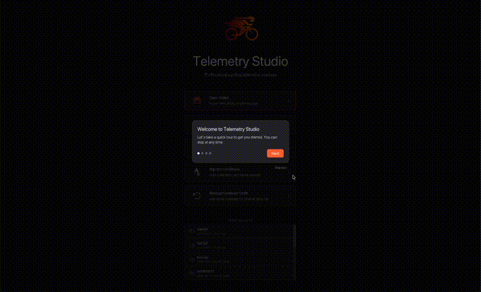

# iced_tour

Guided tour / onboarding overlay for [iced](https://iced.rs) applications.

Built for and extracted from [Telemetry Studio](https://telemetrystudio.com), a desktop app for cycling video overlays.

[](https://crates.io/crates/iced_tour)
[](https://docs.rs/iced_tour)
[](LICENSE-MIT)
[](https://github.com/bartlomein/iced_tour/actions/workflows/ci.yml)

[]()



## Features

- Full-screen backdrop with spotlight cutout around target UI areas
- Tooltip card with title, description, dot indicators, and navigation buttons
- Builder pattern API for defining tour steps
- Dark and light theme presets with full customization
- `tour_steps![]` convenience macro for quick definitions
- Zero-cost when inactive (returns invisible `Space`)
- Works with iced's `stack![]` composition — no custom overlay system needed
- Designed to be LLM-friendly: self-documenting types and actionable doc comments

## Quick Start

```rust
use iced_tour::{TourState, TourStep, TourTheme, TourMessage, tour_overlay, tour_steps};

// 1. Define your steps
let steps = tour_steps![
    "Welcome" => "Let's take a quick tour of the app",
    "Editor" => "This is where you edit your content",
    "Timeline" => "Arrange your clips here",
];

// 2. Create state (inactive by default)
let mut tour_state = TourState::new(steps);

// 3. Start the tour when ready
tour_state.start();
```

## Integration

### Add to your App struct

```rust
use iced_tour::{TourManager, TourManagerMessage, TourTheme};

struct App {
    tour_manager: TourManager,
    tour_theme: TourTheme,
    // ... your other fields
}
```

### Add to your Message enum

```rust
use iced_tour::TourManagerMessage;
use iced::Rectangle;

enum Message {
    Tour(TourManagerMessage),
    TourBoundsResolved(Rectangle),
    // ... your other messages
}
```

### Initialize with named tours

```rust
let tour_manager = TourManager::new()
    .add_tour("welcome", vec![
        TourStep::new("Welcome", "Let's take a quick tour"),
        TourStep::new("Import", "Click here to get started")
            .target_id("import_button")
            .card_position(CardPosition::Right),
    ]);
```

### Add to your view (stack composition)

```rust
use iced_tour::tour_manager_overlay;

fn view(&self) -> Element<Message> {
    // Tag widgets you want to spotlight
    let import_btn = container(button("Import"))
        .id(widget::Id::new("import_button"));

    stack![
        self.view_main_content(),
        tour_manager_overlay(&self.tour_manager, &self.tour_theme, Message::Tour),
    ]
    .into()
}
```

### Handle messages in update

```rust
fn update(&mut self, message: Message) -> iced::Task<Message> {
    match message {
        Message::Tour(msg) => {
            self.tour_manager.update(msg);
            return self.tour_manager.resolve_bounds_task(Message::TourBoundsResolved);
        }
        Message::TourBoundsResolved(bounds) => {
            self.tour_manager.set_resolved_bounds_animated(
                bounds,
                &self.tour_theme.animation,
            );
        }
        // ...
    }
    iced::Task::none()
}
```

## Tour Steps

Steps can highlight specific UI areas in three ways:

```rust
use iced_tour::{TourStep, CardPosition};
use iced::{Rectangle, Point, Size};

// 1. Centered card (no target — works without knowing layout positions)
TourStep::new("Welcome", "Let's explore the app");

// 2. Widget ID targeting (recommended — resolved at runtime, works on any screen size)
TourStep::new("Open Video", "Click here to import your footage")
    .target_id("open_video")
    .card_position(CardPosition::Right);

// 3. Manual rectangle (for panels with known dimensions)
TourStep::new("Sidebar", "Your files are here")
    .target(Rectangle::new(Point::new(0.0, 48.0), Size::new(280.0, 500.0)))
    .card_position(CardPosition::Right);
```

### Widget ID Targeting

The recommended approach. Wrap your target widget in a `container` with an ID, and the spotlight will find it automatically:

```rust
// In your view(), tag widgets:
container(my_button).id(widget::Id::new("open_video"))

// In your step definition:
TourStep::new("Open Video", "Click here to import")
    .target_id("open_video")
```

This works on any screen size and adapts to layout changes — no pixel math needed.

## Themes

```rust
use iced_tour::TourTheme;

// Presets
let dark = TourTheme::dark();
let light = TourTheme::light();

// Customize
let custom = TourTheme::dark()
    .with_fonts(iced::Font::with_name("Inter"))
    .with_backdrop_opacity(0.8);

// Or set individual fields
let mut theme = TourTheme::dark();
theme.button_color = iced::Color::from_rgb(1.0, 0.42, 0.21);
```

## API Reference

| Function / Type | Description |
|---|---|
| `TourManager::new()` | Create a multi-tour manager |
| `.add_tour(name, steps)` | Register a named tour |
| `.start(name)` | Start a named tour |
| `.is_completed(name)` | Check if a tour was completed |
| `.resolve_bounds_task(mapper)` | Get Task to resolve widget ID bounds |
| `TourStep::new(title, desc)` | Step with centered card (no cutout) |
| `.target_id(id)` | Spotlight a widget by container ID (recommended) |
| `.target(rect)` | Spotlight a manual rectangle |
| `.card_position(pos)` | Control card placement |
| `tour_manager_overlay(mgr, theme, mapper)` | Overlay for multi-tour manager |
| `tour_overlay(state, theme, mapper)` | Overlay for single tour |
| `tour_steps![...]` | Convenience macro |
| `TourTheme::dark()` / `light()` | Theme presets |
| `TourAnimation::default()` / `none()` | Animation config (300ms EaseOutCubic / disabled) |

## Examples

```bash
cargo run --example minimal    # Simplest possible tour — centered cards, no targets
cargo run --example basic      # Panel layout with manual rectangle targets
cargo run --example widget_id  # Widget ID targeting — spotlight follows widgets on resize
cargo run --example theming    # Dark, light, and custom color themes
```

## Compatibility

- **Minimum iced version**: 0.14
- **Minimum Rust version**: 1.88

## License

Licensed under either of

- Apache License, Version 2.0 ([LICENSE-APACHE](LICENSE-APACHE) or <http://www.apache.org/licenses/LICENSE-2.0>)
- MIT License ([LICENSE-MIT](LICENSE-MIT) or <http://opensource.org/licenses/MIT>)

at your option.
